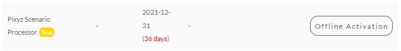

# Install nodelocked trial license
1. Generate an activation code (.bin) by right-clicking on `1_Generate_Activation_Code.bat` and clicking on *Run as administrator*
2. Visit [Pixyz license management web page](https://www.pixyz-software.com/my-account/license-management/) (login required) and click on *Offline Activation* from the line where Pixyz Scenario Processor trial license is listed

3. From the popup window, upload the .bin file, click on *Activate License*
4. Download **in this folder** the new .bin generated file from the line where Pixyz Scenario Processor trial license is listed
4. Double click on `2_Install_License.bat`