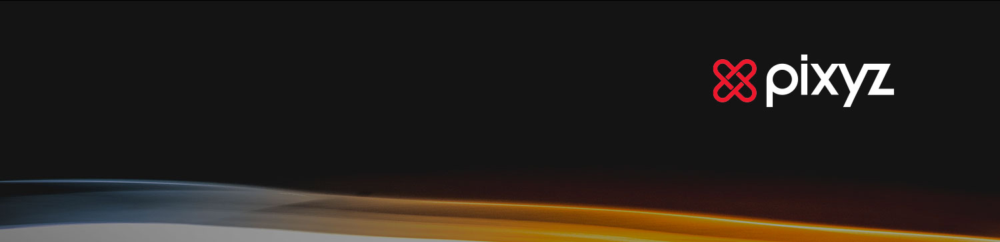
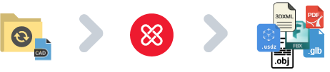
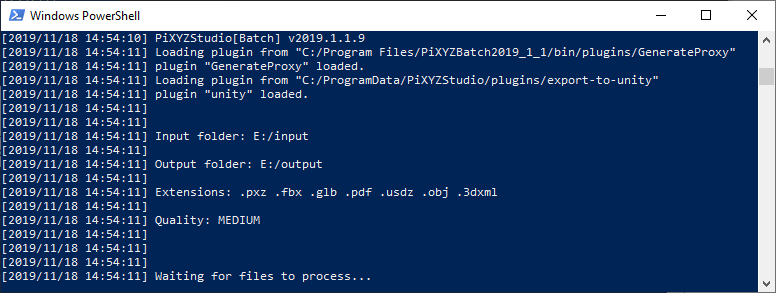
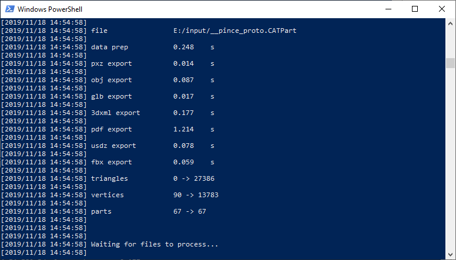
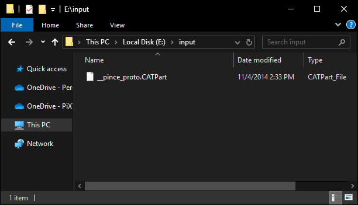
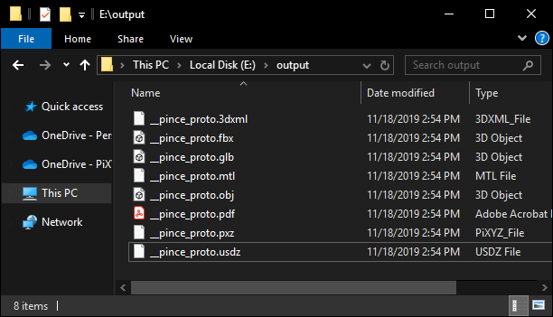

# What is the Folder Watcher sample?

This sample demonstrates how to implement a classic I/O batch instance using Pixyz Batch to listen to an input folder on your disk. The batch instance will import all files popping in this folder, optimize them, and export them to any [desired formats](https://www.pixyz-software.com/documentations/html/2019.1/studio/SupportedFileFormats.html) in an output folder.
<p align="center">
    
</p>

Watching an input folder  |  Exporting automatically in an output folder
:-------------------------:|:-------------------------:
 | 


Input folder               |  Output folder
:-------------------------:|:-------------------------:
 | 


# Getting Started

## Required Software

|
:-------------:|
Pixyz Batch |

## Set Up

* Open *scripts/config.json*
* Optional: change input_folder/output_folder (absolute or relative path)
* Choose the output quality setting ("HIGH", "MEDIUM" or "LOW")
* Choose the targeted formats in "extensions"
* Check that *run.bat* targets your PiXYZBatch.exe installation

## Run

* Double click on *run.bat* or run it from a terminal: a "Waiting for files to process..." message should appear
* Copy paste a file in the input folder and wait for the output files to appear in the output folder

# Customize

The *BatchFile.runPixyzProcess* function defines the steps of data preparation to execute for each quality preset. The 3 steps will work with most workflows and input data (CAD model, polygonal model, CAD+mesh model):
1. **RepairCAD** (*algo.repairCAD*): repair CAD shapes if present, assemble faces, remove duplicated faces, optimize loops and repair topology. This step is essential before tessellating CAD data
2. **Decimate** (*algo.decimate*) (optional): reduce the polygon count of the already tessellated shapes if present by removing some vertices. We do this step before the tessellation so it won't affect the upcoming mesh generation.
3. **Tessellate** (*algo.tessellate*): create a mesh from not-already tessellated CAD representations if present

Add any of the functions you want from the [Pixyz API](https://www.pixyz-software.com/documentations/html/2020.1/studio/api/index.html) after these steps. For example: the *algo.removeHoles([scene.getRoot()], True, True, True, 15, 0)* function will remove holes having diameters lower than 15mm from your model. Add a small decimation (*algo.decimate([scene.getRoot()], 0.1)*) to clean it afterward.

More information about scripting with Pixyz Python API available [here](https://www.pixyz-software.com/documentations/html/2020.1/studio/ScriptingWiththePythonAPI.html).

More information about Pixyz algorithms are available in the [*Pixyz fundamentals*](https://www.pixyz-software.com/documentations/html/2020.1/studio/PixyzFundamentals.html) sections of your product [documentation](https://www.pixyz-software.com/documentations/).


# Advanced: Unity export

This sample can be extended to directly generate Unity assets (*.prefab*) or compiled Unity projects (*.exe*, *.apk*). Check the export-to-unity branch for more information:

```console
git checkout export-to-unity 
```